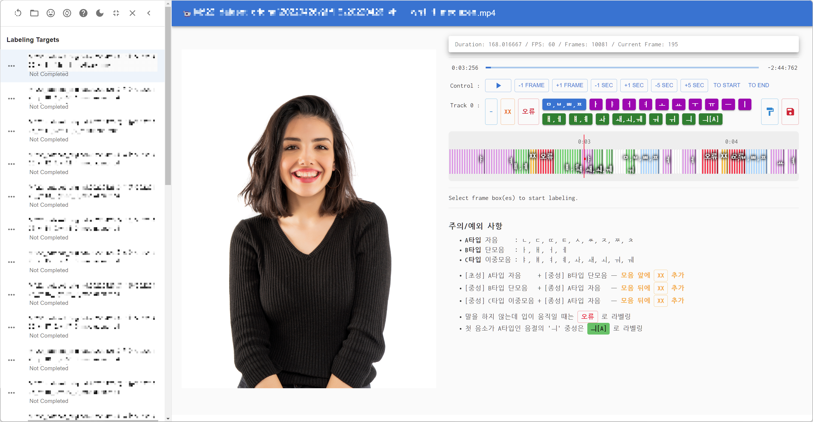

# Viseme Labeling Tool

_VisLab, a electron-based viseme labeler_

- Configurable viseme classes (look `src/visemes`)
- In-editor notice support (look `src/renderer/EditorNotice.tsx`)
- Electron-based multi-OS support
- Light/dark mode support
- Frame-by-frame labeling support

---

**How to use**

1. Select a folder with mp4 files.
2. Select a file on the app.
3. Select frame bars.
4. Label it.
5. After labeling, click painter icon to fill all unlabeled frames with no-viseme label.
6. Click save button to save labels to a file.
7. Check the directory where mp4 files are located. There may be some .csv files.

Have a good time with this tool!
